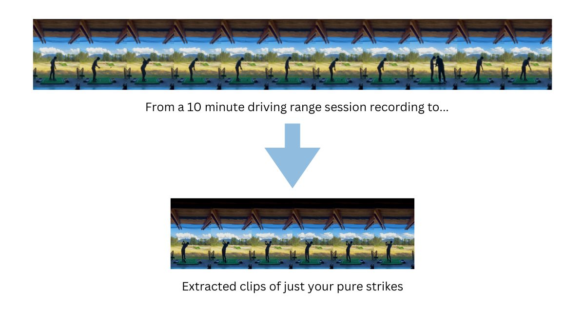

# Golf Swing Detection and Analysis

## Table of Contents
- [Introduction](#introduction)
- [Project Overview](#project-overview)
- [Project Structure](#project-structure)

## Introduction
<p align="center">
  
</p>

As a self-learning golfer, I find it very helpful to review my swing mechanics to identify areas for improvement, especially when I'm out at the driving range working on my game. However, manually reviewing and annotating swing videos can be a time-consuming and tedious task. This tool addresses this pain point by providing a solution that can automatically detect golf swings within your video recordings and extract key information about each swing. It is aimed at making your driving range sessions more productive by providing instant, actionable feedback.

## Project Overview
This project aims to automatically detect and analyze golf swings from video footage. It utilizes computer vision techniques and machine learning models (Stacking Roboflow's open-source object detection models and custom PyTorch models) to identify golf swings, extract relevant features, and classify swing sequences. Currently, the best performing model is LSTM trained on fixed-length time series sequences of golf club and club head trajectories.

## Project Structure
```
├── input_videos/ # Raw driving range session footages
├── models/ # Trained model weights 
├── output_videos/ # Edited footages with only extracted swings
├── predictions/ # Roboflow Object detection results as jsonl files
├── scripts/roboflow_pipeline.py # Generate roboflow predictions under predictions/
├── sequences/ # Preprocessed predictions + swing_intervals to combined sequences of all footages, ready for ML models 
├── swing_intervals/ # Manually labeled swing intervals 
├── *.ipynb # Jupyter notebooks for various stages of the project 
├── models.py # Model architectures 
├── golf_swing_analyzer.py # Helper classes and functions for swing analysis used in notebooks
```

## Notebooks (in order of execution)
1. Inference: Object detection for golf club and club head tracking using Roboflow API
2. Label Data: Manual swing sequence labeling using ipywidgets
3. Process Data: Preprocessing Time series data by combing object detection predictions and labels: interpolation, normalization, and possible feature engineering.
4. Train: Current machine learning models for swing detection:
    - Logistic Regression 
    - Multi-Layer Perceptron (MLP)
    - Long Short-Term Memory (LSTM)
    - Bidirectional LSTM
    - Transsformer
5. Predict: Model performance comparison and evaluation on unseen data
6. Deoploy: Combine with Roboflow interence API to deploy model for real-time swing detection.

## Requirements
- Python 3.9
- PyTorch
- NumPy
- Pandas
- Scikit-learn
- OpenCV
- Plotly (for visualization)
and more, will add conda environment

